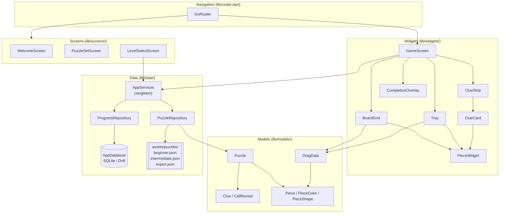
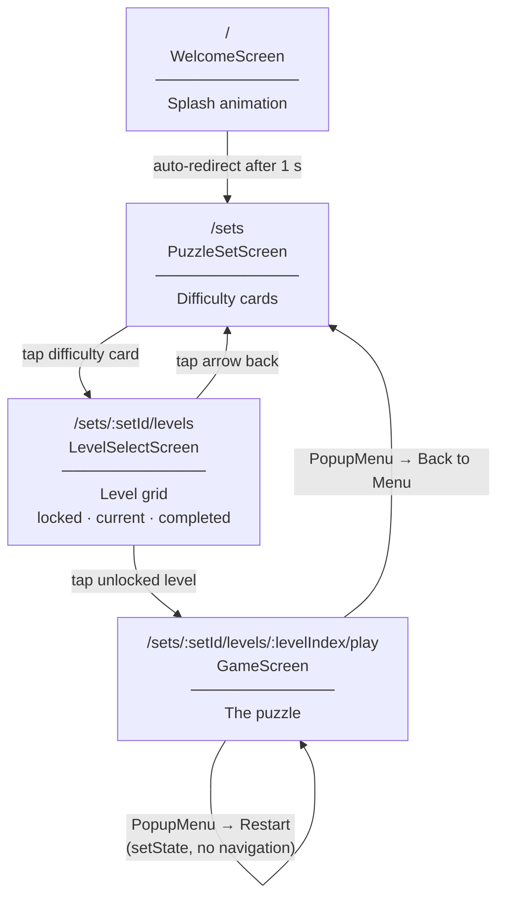
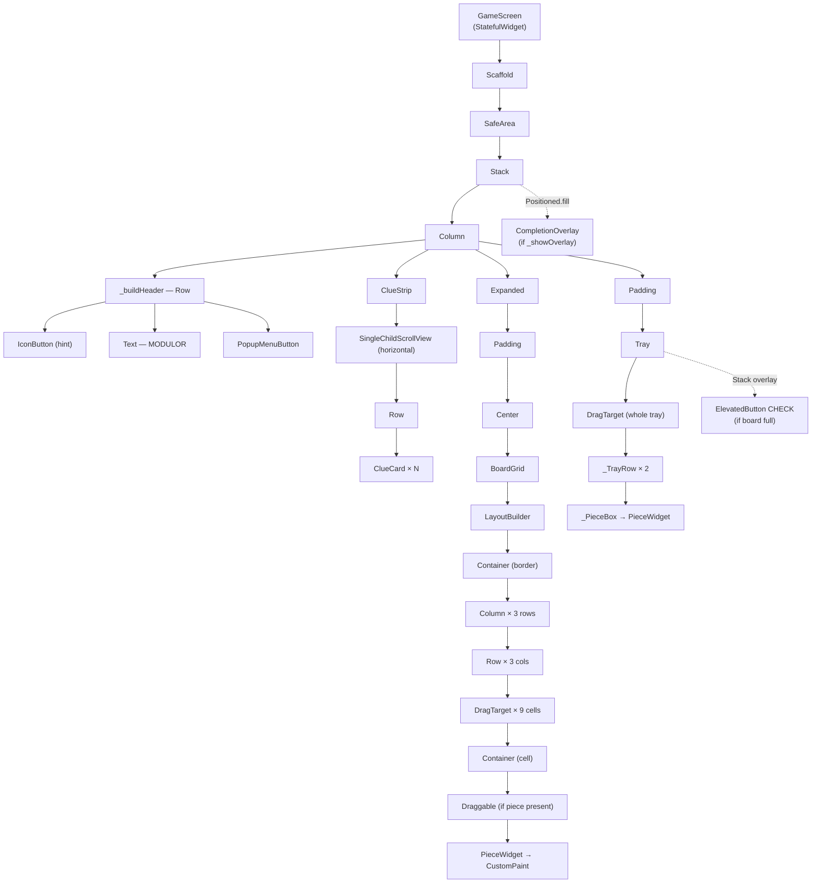
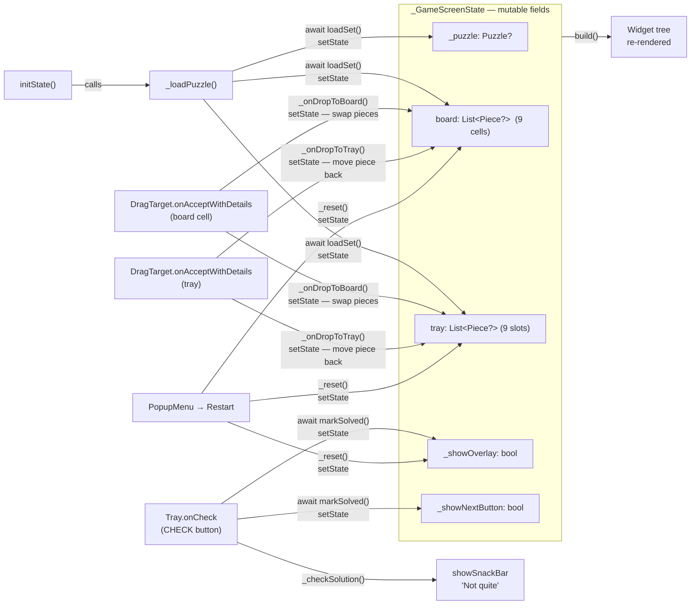
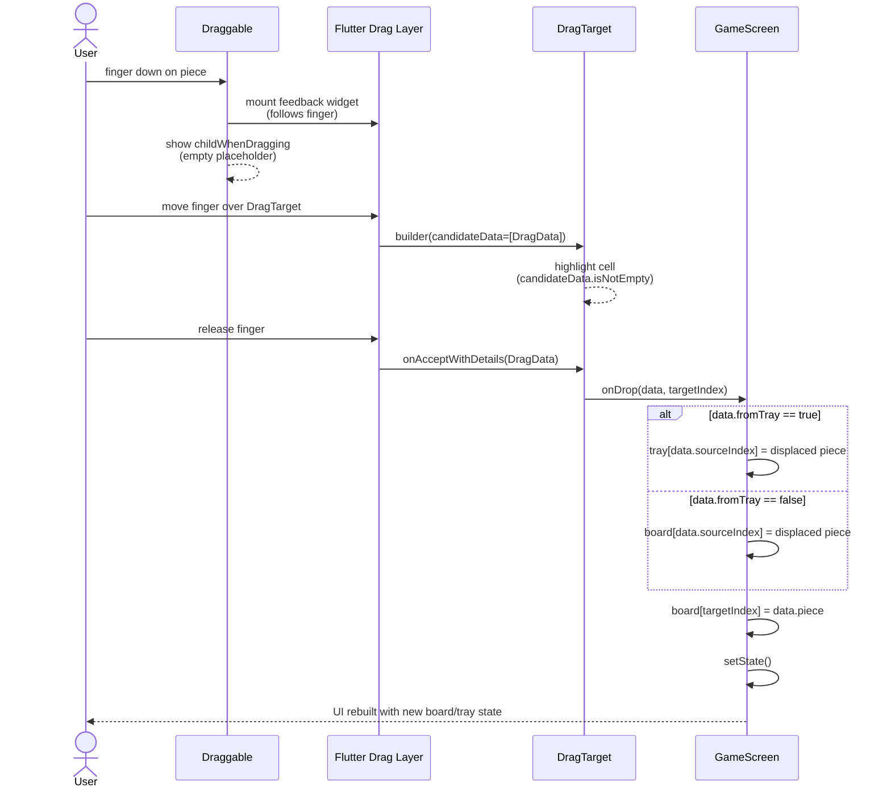
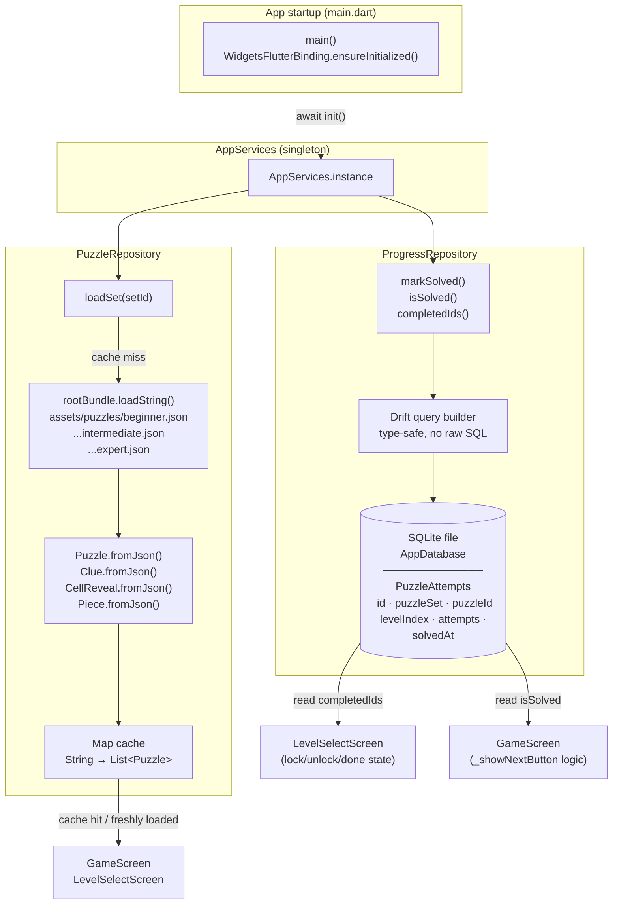
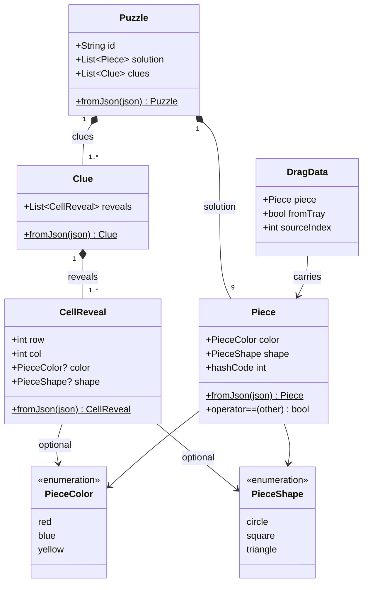
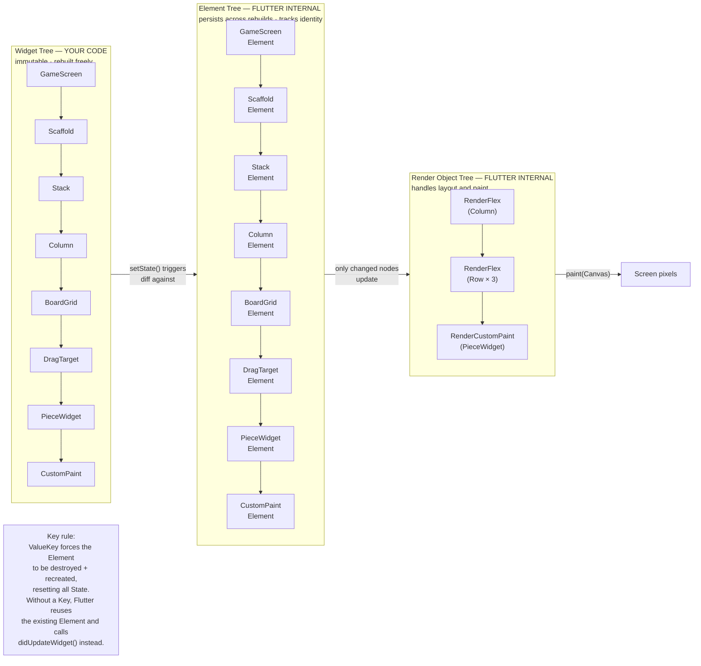
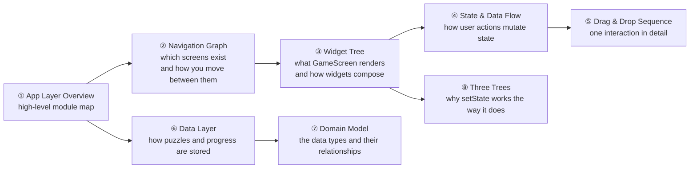

# Modulor — Flutter Architecture Diagrams

Eight diagrams covering the app from the highest level down to individual runtime mechanics.

---

## 1. App Layer Overview

How the four source layers relate to each other. Arrows mean "depends on / uses".

---

## 2. Navigation Route Graph

Every screen and every navigation action. Labels show what triggers each transition.

---

## 3. GameScreen Widget Tree

The full widget hierarchy inside `GameScreen.build()`. Dashed borders mark widgets defined in separate files.

---

## 4. State Fields & Data Flow in GameScreen

The five state fields in `_GameScreenState`, what initialises them, and what mutates them.

---

## 5. Drag & Drop — Event Sequence

What happens from the moment a finger touches a piece to the moment `setState` is called.

---

## 6. Data Layer — Loading & Persistence

How puzzle data and progress data move through the app.

---

## 7. Domain Model — Class Diagram

The complete data model and how the types relate to each other.

---

## 8. Flutter's Three Trees

Flutter maintains three parallel trees at runtime. You write the **Widget tree**; Flutter manages the other two. Understanding this explains why `setState` is cheap and why `Key` matters.

---

## How the Diagrams Relate

